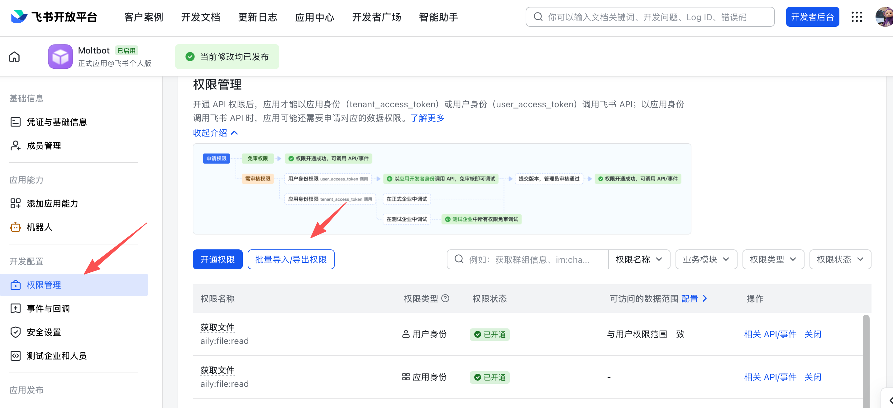

# Feishu 机器人

Feishu（Lark）是一家公司用于消息传递和协作的团队聊天平台。此插件通过平台的 WebSocket 事件订阅将 OpenClaw 连接到 Feishu/Lark 机器人，从而无需公开 webhook URL 即可接收消息。

---

## 需要插件

安装 Feishu 插件：

```bash
openclaw plugins install @openclaw/feishu
```

本地检出（当从 git 仓库运行时）：

```bash
openclaw plugins install ./extensions/feishu
```

---

## 快速开始

有两种方法添加 Feishu 频道：

### 方法 1：入门向导（推荐）

如果您刚安装了 OpenClaw，请运行向导：

```bash
openclaw onboard
```

向导将引导您完成以下步骤：

1. 创建 Feishu 应用并收集凭证
2. 在 OpenClaw 中配置应用凭证
3. 启动网关

✅ **配置完成后**，检查网关状态：

- `openclaw gateway status`
- `openclaw logs --follow`

### 方法 2：CLI 设置

如果您已完成初始安装，请通过 CLI 添加频道：

```bash
openclaw channels add
```

选择 **Feishu**，然后输入 App ID 和 App Secret。

✅ **配置完成后**，管理网关：

- `openclaw gateway status`
- `openclaw gateway restart`
- `openclaw logs --follow`

---

## 步骤 1：创建 Feishu 应用

### 1. 打开 Feishu 开放平台

访问 [Feishu 开放平台](https://open.feishu.cn/app) 并登录。

Lark（全球版）租户应使用 [https://open.larksuite.com/app](https://open.larksuite.com/app) 并在 Feishu 配置中设置 `domain: "lark"`。

### 2. 创建应用

1. 点击 **创建企业应用**
2. 填写应用名称 + 描述
3. 选择应用图标


### 3. 复制凭证

从 **凭证与基本信息** 中复制：

- **App ID**（格式：`cli_xxx`）
- **App Secret**

❗ **重要：** 保持 App Secret 私密。


### 4. 配置权限

在 **权限** 页面，点击 **批量导入** 并粘贴：

```json
{
  "scopes": {
    "tenant": [
      "aily:file:read",
      "aily:file:write",
      "application:application.app_message_stats.overview:readonly",
      "application:application:self_manage",
      "application:bot.menu:write",
      "cardkit:card:read",
      "cardkit:card:write",
      "contact:user.employee_id:readonly",
      "corehr:file:download",
      "event:ip_list",
      "im:chat.access_event.bot_p2p_chat:read",
      "im:chat.members:bot_access",
      "im:message",
      "im:message.group_at_msg:readonly",
      "im:message.p2p_msg:readonly",
      "im:message:readonly",
      "im:message:send_as_bot",
      "im:resource"
    ],
    "user": ["aily:file:read", "aily:file:write", "im:chat.access_event.bot_p2p_chat:read"]
  }
}
```



### 5. 启用机器人功能

在 **应用能力** > **机器人** 中：

1. 启用机器人功能
2. 设置机器人名称


### 6. 配置事件订阅

⚠️ **重要：** 在设置事件订阅之前，请确保：

1. 您已经为 Feishu 运行了 `openclaw channels add`
2. 网关正在运行（`openclaw gateway status`）

在 **事件订阅** 中：

1. 选择 **使用长连接接收事件（WebSocket）**
2. 添加事件：`im.message.receive_v1`

⚠️ 如果网关未运行，长连接设置可能无法保存。


### 7. 发布应用

1. 在 **版本管理与发布** 中创建版本
2. 提交审核并发布
3. 等待管理员批准（企业应用通常自动批准）

---

## 步骤 2：配置 OpenClaw

### 使用向导配置（推荐）

```bash
openclaw channels add
```

选择 **Feishu** 并粘贴您的 App ID + App Secret。

### 通过配置文件配置

编辑 `~/.openclaw/openclaw.json`：

```json5
{
  channels: {
    feishu: {
      enabled: true,
      dmPolicy: "pairing",
      accounts: {
        main: {
          appId: "cli_xxx",
          appSecret: "xxx",
          botName: "My AI assistant",
        },
      },
    },
  },
}
```

如果您使用 `connectionMode: "webhook"`，请设置 `verificationToken`。Feishu webhook 服务器默认绑定到 `127.0.0.1`；仅当您确实需要不同的绑定地址时，才设置 `webhookHost`。

#### 验证令牌（Webhook 模式）

使用 Webhook 模式时，请在配置中设置 `channels.feishu.verificationToken`。获取该值的方法：

1. 在 Feishu 开放平台，打开您的应用
2. 前往 **开发** → **事件与回调**（开发配置 → 事件与回调）
3. 打开 **加密策略** 标签页（加密策略）
4. 复制 **验证令牌**


### 通过环境变量配置

```bash
export FEISHU_APP_ID="cli_xxx"
export FEISHU_APP_SECRET="xxx"
```

### Lark（全球版）域名

如果您的租户在 Lark（国际版），请将域名设置为 `lark`（或完整域名字符串）。您可以在 `channels.feishu.domain` 处设置，或在每个账户下设置（`channels.feishu.accounts.<id>.domain`）。

```json5
{
  channels: {
    feishu: {
      domain: "lark",
      accounts: {
        main: {
          appId: "cli_xxx",
          appSecret: "xxx",
        },
      },
    },
  },
}
```

### 配额优化标志

您可以通过两个可选标志减少 Feishu API 的使用量：

- `typingIndicator`（默认 `true`）：当 `false` 时，跳过输入反应调用。
- `resolveSenderNames`（默认 `true`）：当 `false` 时，跳过发送者资料查找调用。

在顶层或每个账户下设置：

```json5
{
  channels: {
    feishu: {
      typingIndicator: false,
      resolveSenderNames: false,
      accounts: {
        main: {
          appId: "cli_xxx",
          appSecret: "xxx",
          typingIndicator: true,
          resolveSenderNames: false,
        },
      },
    },
  },
}
```

---

## 步骤 3：启动 + 测试

### 1. 启动网关

```bash
openclaw gateway
```

### 2. 发送测试消息

在 Feishu 中，找到您的机器人并发送一条消息。

### 3. 批准配对

默认情况下，机器人会回复配对码。请批准它：

```bash
openclaw pairing approve feishu <CODE>
```

批准后，您可以正常聊天。

---

## 概述

- **Feishu 机器人频道**：由网关管理的 Feishu 机器人
- **确定性路由**：回复始终返回至 Feishu
- **会话隔离**：私聊共享主会话；群组相互隔离
- **WebSocket 连接**：通过 Feishu SDK 的长连接，无需公共 URL

---

## 访问控制

### 直接消息

- **默认**：`dmPolicy: "pairing"`（未知用户获得配对码）
- **批准配对**：

  ```bash
  openclaw pairing list feishu
  openclaw pairing approve feishu <CODE>
  ```

- **白名单模式**：设置 `channels.feishu.allowFrom` 以允许 Open IDs

### 群聊

**1. 群组策略（`channels.feishu.groupPolicy`）：**

- `"open"` = 允许群组中的所有人（默认）
- `"allowlist"` = 仅允许 `groupAllowFrom`
- `"disabled"` = 禁用群消息

**2. @提及要求（`channels.feishu.groups.<chat_id>.requireMention`）：**

- `true` = 需要@提及（默认）
- `false` = 无需提及即可响应

---

## 群组配置示例

### 允许所有群组，需要@提及（默认）

```json5
{
  channels: {
    feishu: {
      groupPolicy: "open",
      // Default requireMention: true
    },
  },
}
```

### 允许所有群组，无需@提及

```json5
{
  channels: {
    feishu: {
      groups: {
        oc_xxx: { requireMention: false },
      },
    },
  },
}
```

### 仅允许特定群组

```json5
{
  channels: {
    feishu: {
      groupPolicy: "allowlist",
      // Feishu group IDs (chat_id) look like: oc_xxx
      groupAllowFrom: ["oc_xxx", "oc_yyy"],
    },
  },
}
```

### 限制哪些发送者可以在群组中发消息（发送者白名单）

除了允许群组本身外，该群组中的所有消息都由发送者 open_id 进行限制：只有列在 `groups.<chat_id>.allowFrom` 中的用户的消息会被处理；来自其他成员的消息将被忽略（这是完整的发送者级别限制，不仅针对 /reset 或 /new 等控制命令）。

```json5
{
  channels: {
    feishu: {
      groupPolicy: "allowlist",
      groupAllowFrom: ["oc_xxx"],
      groups: {
        oc_xxx: {
          // Feishu user IDs (open_id) look like: ou_xxx
          allowFrom: ["ou_user1", "ou_user2"],
        },
      },
    },
  },
}
```

---

## 获取群组/用户 ID

### 群组 ID（chat_id）

群组 ID 看起来像 `oc_xxx`。

**方法 1（推荐）**

1. 启动网关并在群组中@提及机器人
2. 运行 `openclaw logs --follow` 并查找 `chat_id`

**方法 2**

使用 Feishu API 调试器列出群聊。

### 用户 ID（open_id）

用户 ID 看起来像 `ou_xxx`。

**方法 1（推荐）**

1. 启动网关并给机器人发私信
2. 运行 `openclaw logs --follow` 并查找 `open_id`

**方法 2**

检查用户的 Open ID 配对请求：

```bash
openclaw pairing list feishu
```

---

## 常用命令

| 命令   | 描述       |
| --------- | ----------------- |
| `/status` | 显示机器人状态   |
| `/reset`  | 重置会话 |
| `/model`  | 显示/切换模型 |

> 注意：Feishu 尚不支持原生命令菜单，因此命令必须作为文本发送。

## 网关管理命令

| 命令                    | 描述                   |
| -------------------------- | ----------------------------- |
| `openclaw gateway status`  | 显示网关状态           |
| `openclaw gateway install` | 安装/启动网关服务 |
| `openclaw gateway stop`    | 停止网关服务          |
| `openclaw gateway restart` | 重启网关服务       |
| `openclaw logs --follow`   | 查看网关日志             |

---

## 故障排除

### 机器人在群聊中无响应

1. 确保机器人已加入群组
2. 确保您 @mention 了机器人（默认行为）
3. 检查 `groupPolicy` 未设置为 `"disabled"`
4. 检查日志：`openclaw logs --follow`

### 机器人无法接收消息

1. 确保应用已发布并获批
2. 确保事件订阅包含 `im.message.receive_v1`
3. 确保启用了 **长连接**
4. 确保应用权限完整
5. 确保网关正在运行：`openclaw gateway status`
6. 检查日志：`openclaw logs --follow`

### App Secret 泄露

1. 在飞书开放平台重置 App Secret
2. 更新配置中的 App Secret
3. 重启网关

### 消息发送失败

1. 确保应用拥有 `im:message:send_as_bot` 权限
2. 确保应用已发布
3. 检查日志以获取详细错误信息

---

## 高级配置

### 多账号

```json5
{
  channels: {
    feishu: {
      defaultAccount: "main",
      accounts: {
        main: {
          appId: "cli_xxx",
          appSecret: "xxx",
          botName: "Primary bot",
        },
        backup: {
          appId: "cli_yyy",
          appSecret: "yyy",
          botName: "Backup bot",
          enabled: false,
        },
      },
    },
  },
}
```

`defaultAccount` 控制当出站 API 未明确指定 `accountId` 时使用哪个飞书账号。

### 消息限制

- `textChunkLimit`: 出站文本块大小（默认值：2000 字符）
- `mediaMaxMb`: 媒体上传/下载限制（默认值：30MB）

### 流式传输

飞书支持通过交互式卡片进行流式回复。启用后，机器人会在生成文本时更新卡片。

```json5
{
  channels: {
    feishu: {
      streaming: true, // enable streaming card output (default true)
      blockStreaming: true, // enable block-level streaming (default true)
    },
  },
}
```

设置 `streaming: false` 以在发送前等待完整回复。

### 多智能体路由

使用 `bindings` 将飞书私聊或群组路由到不同的智能体。

```json5
{
  agents: {
    list: [
      { id: "main" },
      {
        id: "clawd-fan",
        workspace: "/home/user/clawd-fan",
        agentDir: "/home/user/.openclaw/agents/clawd-fan/agent",
      },
      {
        id: "clawd-xi",
        workspace: "/home/user/clawd-xi",
        agentDir: "/home/user/.openclaw/agents/clawd-xi/agent",
      },
    ],
  },
  bindings: [
    {
      agentId: "main",
      match: {
        channel: "feishu",
        peer: { kind: "direct", id: "ou_xxx" },
      },
    },
    {
      agentId: "clawd-fan",
      match: {
        channel: "feishu",
        peer: { kind: "direct", id: "ou_yyy" },
      },
    },
    {
      agentId: "clawd-xi",
      match: {
        channel: "feishu",
        peer: { kind: "group", id: "oc_zzz" },
      },
    },
  ],
}
```

路由字段：

- `match.channel`: `"feishu"`
- `match.peer.kind`: `"direct"` 或 `"group"`
- `match.peer.id`: 用户 Open ID（`ou_xxx`）或群组 ID（`oc_xxx`）

查看 [获取群组/用户 ID](#get-groupuser-ids) 以获取查找提示。

---

## 配置参考

完整配置：[网关配置](/gateway/configuration)

关键选项：

| Setting                                           | Description                             | Default          |
| ------------------------------------------------- | --------------------------------------- | ---------------- |
| `channels.feishu.enabled`                         | 启用/禁用频道                          | `true`           |
| `channels.feishu.domain`                          | API 域名（`feishu` 或 `lark`）         | `feishu`         |
| `channels.feishu.connectionMode`                  | 事件传输模式                            | `websocket`      |
| `channels.feishu.defaultAccount`                  | 出站路由的默认账号 ID                   | `default`        |
| `channels.feishu.verificationToken`               | Webhook 模式必需                        | -                |
| `channels.feishu.webhookPath`                     | Webhook 路由路径                        | `/feishu/events` |
| `channels.feishu.webhookHost`                     | Webhook 绑定主机                        | `127.0.0.1`      |
| `channels.feishu.webhookPort`                     | Webhook 绑定端口                        | `3000`           |
| `channels.feishu.accounts.<id>.appId`             | App ID                                  | -                |
| `channels.feishu.accounts.<id>.appSecret`         | App Secret                              | -                |
| `channels.feishu.accounts.<id>.domain`            | 按账号覆盖 API 域名                     | `feishu`         |
| `channels.feishu.dmPolicy`                        | DM 策略                                 | `pairing`        |
| `channels.feishu.allowFrom`                       | DM 白名单（open_id 列表）               | -                |
| `channels.feishu.groupPolicy`                     | 群组策略                                | `open`           |
| `channels.feishu.groupAllowFrom`                  | 群组白名单                              | -                |
| `channels.feishu.groups.<chat_id>.requireMention` | 需要 @mention                           | `true`           |
| `channels.feishu.groups.<chat_id>.enabled`        | 启用群组                                | `true`           |
| `channels.feishu.textChunkLimit`                  | 消息块大小                              | `2000`           |
| `channels.feishu.mediaMaxMb`                      | 媒体大小限制                            | `30`             |
| `channels.feishu.streaming`                       | 启用流式卡片输出                        | `true`           |
| `channels.feishu.blockStreaming`                  | 启用块流式传输                          | `true`           |

---

## dmPolicy 参考

| Value         | Behavior                                                        |
| ------------- | --------------------------------------------------------------- |
| `"pairing"`   | **默认。** 未知用户会获得配对码；必须经过批准       |
| `"allowlist"` | 仅 `allowFrom` 中的用户可以聊天                               |
| `"open"`      | 允许所有用户（需要在 allowFrom 中包含 `"*"`）                   |
| `"disabled"`  | 禁用 DM                                                           |

---

## 支持的消息类型

### 接收

- ✅ 文本
- ✅ 富文本（帖子）
- ✅ 图片
- ✅ 文件
- ✅ 音频
- ✅ 视频
- ✅ 贴纸

### 发送

- ✅ 文本
- ✅ 图片
- ✅ 文件
- ✅ 音频
- ⚠️ 富文本（部分支持）