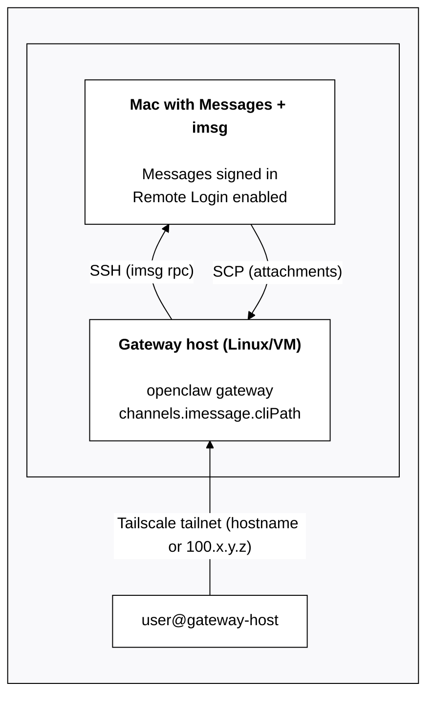

# iMessage (legacy: imsg)

> **推荐:** 对于新的iMessage设置，请使用 [BlueBubbles](/channels/bluebubbles)。
>
> `imsg` 通道是一个旧版的外部CLI集成，未来版本可能会移除。

状态: 旧版外部CLI集成。网关启动 `imsg rpc` (通过stdio的JSON-RPC)。

## 快速设置 (初学者)

1. 确保此Mac上的Messages已登录。
2. 安装 `imsg`:
   - `brew install steipete/tap/imsg`
3. 使用 `channels.imessage.cliPath` 和 `channels.imessage.dbPath` 配置OpenClaw。
4. 启动网关并批准任何macOS提示（自动化 + 完整磁盘访问）。

最小配置:

```json5
{
  channels: {
    imessage: {
      enabled: true,
      cliPath: "/usr/local/bin/imsg",
      dbPath: "/Users/<you>/Library/Messages/chat.db",
    },
  },
}
```

## 什么是它

- 基于macOS上的 `imsg` 的iMessage通道。
- 确定性路由：回复总是返回到iMessage。
- 私信共享代理的主要会话；群组是隔离的 (`agent:<agentId>:imessage:group:<chat_id>`)。
- 如果带有 `is_group=false` 的多参与者线程到达，您可以通过 `chat_id` 使用 `channels.imessage.groups` 将其隔离（见下方“类似群组的线程”）。

## 配置写入

默认情况下，允许iMessage写入由 `/config set|unset` 触发的配置更新（需要 `commands.config: true`）。

禁用方法:

```json5
{
  channels: { imessage: { configWrites: false } },
}
```

## 要求

- 已登录Messages的macOS。
- OpenClaw + `imsg` 的完整磁盘访问权限（Messages数据库访问）。
- 发送时的自动化权限。
- `channels.imessage.cliPath` 可以指向任何代理stdin/stdout的命令（例如，一个通过SSH连接到另一台Mac并运行 `imsg rpc` 的包装脚本）。

## 解决macOS隐私和安全TCC问题

如果发送/接收失败（例如，`imsg rpc` 退出非零状态、超时或网关似乎挂起），常见原因是从未批准的macOS权限提示。

macOS按应用程序/进程上下文授予TCC权限。在运行 `imsg` 的相同上下文中批准提示（例如，终端/iTerm、LaunchAgent会话或SSH启动的进程）。

检查清单:

- **完整磁盘访问**: 允许运行OpenClaw的进程（以及任何执行 `imsg` 的shell/SSH包装器）访问。这是读取Messages数据库 (`chat.db`) 所必需的。
- **自动化 → Messages**: 允许运行OpenClaw的进程（和/或您的终端）控制 **Messages.app** 进行外发发送。
- **`imsg` CLI健康状况**: 验证 `imsg` 已安装并支持RPC (`imsg rpc --help`)。

提示: 如果OpenClaw以无头模式运行（LaunchAgent/systemd/SSH），macOS提示可能会被错过。在GUI终端中运行一次交互式命令以强制显示提示，然后重试:

```bash
imsg chats --limit 1
# or
imsg send <handle> "test"
```

相关的macOS文件夹权限（桌面/文档/下载）: [/platforms/mac/permissions](/platforms/mac/permissions)。

## 设置 (快速路径)

1. 确保此Mac上的Messages已登录。
2. 配置iMessage并启动网关。

### 专用机器人macOS用户（用于隔离身份）

如果您希望机器人从一个**单独的iMessage身份**发送消息（并保持您的个人消息干净），请使用一个专用的Apple ID + 一个专用的macOS用户。

1. 创建一个专用的Apple ID（示例：`my-cool-bot@icloud.com`）。
   - Apple可能需要一个电话号码进行验证/双重认证。
2. 创建一个macOS用户（示例：`openclawhome`）并登录到该用户。
3. 在该macOS用户中打开Messages，并使用机器人Apple ID登录iMessage。
4. 启用远程登录（系统设置 → 常规 → 共享 → 远程登录）。
5. 安装`imsg`：
   - `brew install steipete/tap/imsg`
6. 设置SSH以便`ssh <bot-macos-user>@localhost true`无需密码即可工作。
7. 将`channels.imessage.accounts.bot.cliPath`指向一个运行`imsg`的SSH包装器，作为机器人用户。

首次运行注意事项：发送/接收可能需要在_bot macOS用户_中的GUI批准（自动化 + 完整磁盘访问）。如果`imsg rpc`看起来卡住了或退出，请登录到该用户（屏幕共享有帮助），运行一次`imsg chats --limit 1` / `imsg send ...`，批准提示，然后重试。参见[解决macOS隐私和安全TCC问题](#troubleshooting-macos-privacy-and-security-tcc)。

示例包装器 (`chmod +x`)。将`<bot-macos-user>`替换为您的实际macOS用户名：

```bash
#!/usr/bin/env bash
set -euo pipefail

# Run an interactive SSH once first to accept host keys:
#   ssh <bot-macos-user>@localhost true
exec /usr/bin/ssh -o BatchMode=yes -o ConnectTimeout=5 -T <bot-macos-user>@localhost \
  "/usr/local/bin/imsg" "$@"
```

示例配置：

```json5
{
  channels: {
    imessage: {
      enabled: true,
      accounts: {
        bot: {
          name: "Bot",
          enabled: true,
          cliPath: "/path/to/imsg-bot",
          dbPath: "/Users/<bot-macos-user>/Library/Messages/chat.db",
        },
      },
    },
  },
}
```

对于单账户设置，请使用平面选项 (`channels.imessage.cliPath`, `channels.imessage.dbPath`) 而不是`accounts`映射。

### 远程/SSH变体（可选）

如果您希望在另一台Mac上使用iMessage，请将`channels.imessage.cliPath`设置为一个通过SSH在远程macOS主机上运行`imsg`的包装器。OpenClaw只需要stdio。

示例包装器：

```bash
#!/usr/bin/env bash
exec ssh -T gateway-host imsg "$@"
```

**远程附件：** 当`cliPath`通过SSH指向远程主机时，Messages数据库中的附件路径引用远程机器上的文件。通过设置`channels.imessage.remoteHost`，OpenClaw可以自动通过SCP获取这些文件：

```json5
{
  channels: {
    imessage: {
      cliPath: "~/imsg-ssh", // SSH wrapper to remote Mac
      remoteHost: "user@gateway-host", // for SCP file transfer
      includeAttachments: true,
    },
  },
}
```

如果未设置`remoteHost`，OpenClaw会尝试通过解析包装器脚本中的SSH命令来自动检测它。为了可靠性，建议显式配置。

#### 通过 Tailscale 远程访问 Mac (示例)

如果网关运行在 Linux 主机/虚拟机上，但 iMessage 必须运行在 Mac 上，Tailscale 是最简单的桥梁：网关通过 tailnet 与 Mac 通信，通过 SSH 运行 `imsg`，并通过 SCP 发送附件回来。

架构：



具体配置示例（Tailscale 主机名）：

```json5
{
  channels: {
    imessage: {
      enabled: true,
      cliPath: "~/.openclaw/scripts/imsg-ssh",
      remoteHost: "bot@mac-mini.tailnet-1234.ts.net",
      includeAttachments: true,
      dbPath: "/Users/bot/Library/Messages/chat.db",
    },
  },
}
```

示例包装器 (`~/.openclaw/scripts/imsg-ssh`)：

```bash
#!/usr/bin/env bash
exec ssh -T bot@mac-mini.tailnet-1234.ts.net imsg "$@"
```

注意事项：

- 确保 Mac 已登录 Messages，并且启用了远程登录。
- 使用 SSH 密钥以便 `ssh bot@mac-mini.tailnet-1234.ts.net` 在没有提示的情况下工作。
- `remoteHost` 应该与 SSH 目标匹配，以便 SCP 可以获取附件。

多账户支持：使用 `channels.imessage.accounts` 和每个账户的配置以及可选的 `name`。参见 [`gateway/configuration`](/gateway/configuration#telegramaccounts--discordaccounts--slackaccounts--signalaccounts--imessageaccounts) 了解共享模式。不要提交 `~/.openclaw/openclaw.json`（它通常包含令牌）。

## 访问控制（私信 + 群组）

私信：

- 默认：`channels.imessage.dmPolicy = "pairing"`。
- 未知发送者会收到配对码；消息会被忽略直到批准（码在 1 小时后过期）。
- 通过以下方式批准：
  - `openclaw pairing list imessage`
  - `openclaw pairing approve imessage <CODE>`
- 配对是 iMessage 私信的默认令牌交换方式。详情：[配对](/channels/pairing)

群组：

- `channels.imessage.groupPolicy = open | allowlist | disabled`。
- `channels.imessage.groupAllowFrom` 控制当 `allowlist` 设置时谁可以在群组中触发。
- 提及门控使用 `agents.list[].groupChat.mentionPatterns`（或 `messages.groupChat.mentionPatterns`），因为 iMessage 没有原生提及元数据。
- 多代理覆盖：在 `agents.list[].groupChat.mentionPatterns` 上设置每个代理的模式。

## 工作原理 (行为)

- `imsg` 流式消息事件；网关将它们规范化为共享频道信封。
- 回复总是路由回相同的聊天 ID 或句柄。

## 类似群组的线程 (`is_group=false`)

某些 iMessage 线程可以有多个参与者，但仍然会根据 Messages 存储聊天标识符的方式带有 `is_group=false`。

如果你在 `channels.imessage.groups` 下显式配置了 `chat_id`，OpenClaw 将该线程视为“群组”以进行：

- 会话隔离（单独的 `agent:<agentId>:imessage:group:<chat_id>` 会话密钥）
- 群组白名单 / 提及门控行为

示例：

```json5
{
  channels: {
    imessage: {
      groupPolicy: "allowlist",
      groupAllowFrom: ["+15555550123"],
      groups: {
        "42": { requireMention: false },
      },
    },
  },
}
```

当你希望特定线程有一个独立的性格/模型时这很有用（参见 [多代理路由](/concepts/multi-agent)）。有关文件系统隔离，请参见 [沙箱](/gateway/sandboxing)。

## 媒体 + 限制

- 通过 `channels.imessage.includeAttachments` 可选附件摄取。
- 媒体限制通过 `channels.imessage.mediaMaxMb`。

## 限制

- 发送的文本被分块为 `channels.imessage.textChunkLimit`（默认 4000）。
- 可选换行符分块：设置 `channels.imessage.chunkMode="newline"` 以在长度分块之前按空白行（段落边界）拆分。
- 媒体上传受限于 `channels.imessage.mediaMaxMb`（默认 16）。

## 地址化 / 交付目标

优先使用 `chat_id` 进行稳定路由：

- `chat_id:123`（首选）
- `chat_guid:...`
- `chat_identifier:...`
- 直接句柄：`imessage:+1555` / `sms:+1555` / `user@example.com`

列出聊天：

```
imsg chats --limit 20
```

## 配置参考 (iMessage)

完整配置：[Configuration](/gateway/configuration)

提供商选项：

- `channels.imessage.enabled`: 启用/禁用通道启动。
- `channels.imessage.cliPath`: `imsg` 的路径。
- `channels.imessage.dbPath`: 消息数据库路径。
- `channels.imessage.remoteHost`: 当 `cliPath` 指向远程 Mac（例如，`user@gateway-host`）时，用于 SCP 附件传输的 SSH 主机。未设置时从 SSH 包装器自动检测。
- `channels.imessage.service`: `imessage | sms | auto`。
- `channels.imessage.region`: 短信区域。
- `channels.imessage.dmPolicy`: `pairing | allowlist | open | disabled`（默认：配对）。
- `channels.imessage.allowFrom`: 直接消息白名单（句柄、电子邮件、E.164 号码或 `chat_id:*`）。`open` 需要 `"*"`。iMessage 没有用户名；使用句柄或聊天目标。
- `channels.imessage.groupPolicy`: `open | allowlist | disabled`（默认：白名单）。
- `channels.imessage.groupAllowFrom`: 组发件人白名单。
- `channels.imessage.historyLimit` / `channels.imessage.accounts.*.historyLimit`: 作为上下文包含的最大组消息数（0 表示禁用）。
- `channels.imessage.dmHistoryLimit`: 用户轮次中的直接消息历史记录限制。每个用户的覆盖：`channels.imessage.dms["<handle>"].historyLimit`。
- `channels.imessage.groups`: 每组默认值 + 白名单（使用 `"*"` 进行全局默认设置）。
- `channels.imessage.includeAttachments`: 将附件纳入上下文。
- `channels.imessage.mediaMaxMb`: 入站/出站媒体限制（MB）。
- `channels.imessage.textChunkLimit`: 出站块大小（字符）。
- `channels.imessage.chunkMode`: `length`（默认）或 `newline` 以在长度分块之前按空白行（段落边界）拆分。

相关全局选项：

- `agents.list[].groupChat.mentionPatterns`（或 `messages.groupChat.mentionPatterns`）。
- `messages.responsePrefix`。