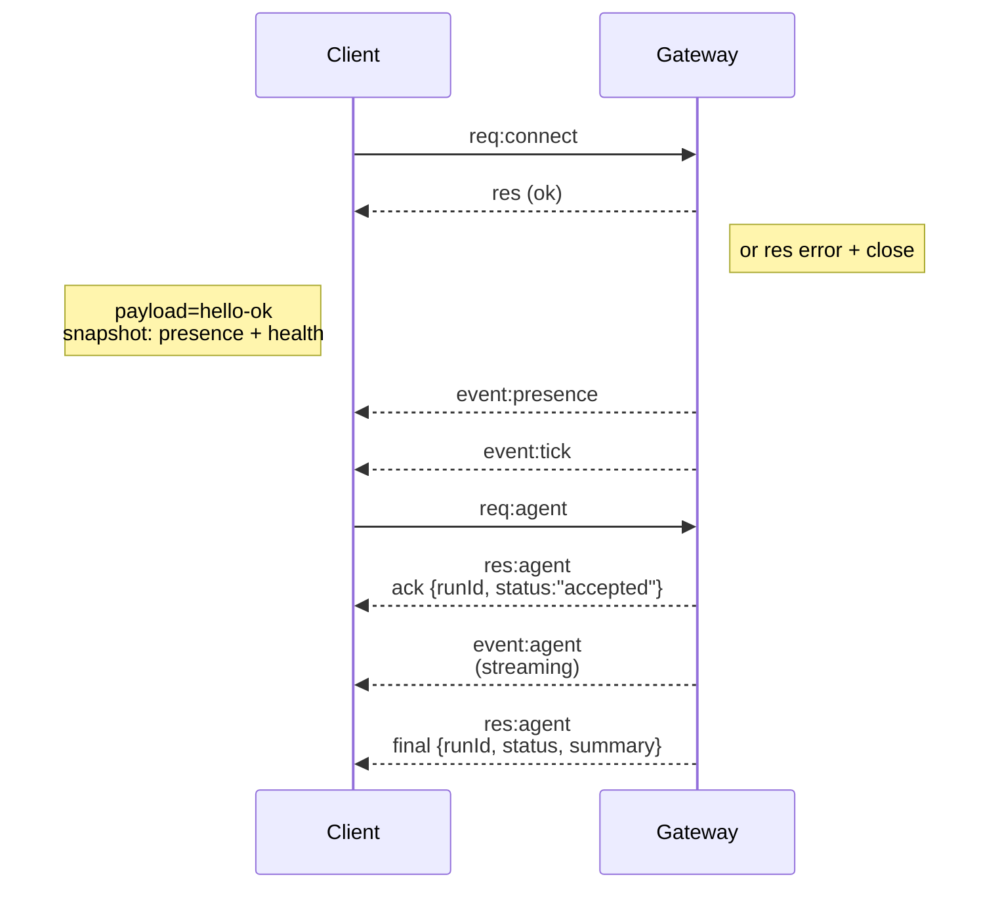

# 网关架构

最后更新：2026-01-22

## 概述

- 一个长期运行的 **Gateway**（网关）管理所有消息收发通道（包括通过 Baileys 接入的 WhatsApp、通过 grammY 接入的 Telegram、Slack、Discord、Signal、iMessage 和 WebChat）。
- 控制平面客户端（macOS 应用、CLI、Web UI、自动化脚本）通过 **WebSocket** 连接到网关，绑定地址为配置的主机（默认为 `127.0.0.1:18789`）。
- **Nodes**（节点，支持 macOS/iOS/Android/无头模式）也通过 **WebSocket** 连接，但需在连接时声明 `role: node`，并显式指定能力（caps）与命令（commands）。
- 每台主机仅运行一个网关；它是唯一可启动 WhatsApp 会话的组件。
- **画布主机（canvas host）** 由网关的 HTTP 服务提供，路径如下：
  - `/__openclaw__/canvas/`（代理可编辑的 HTML/CSS/JS）
  - `/__openclaw__/a2ui/`（A2UI 主机）
    它使用与网关相同的端口（默认为 `18789`）。

## 组件与数据流

### 网关（守护进程）

- 维护各消息平台（provider）的连接。
- 暴露类型化的 WebSocket API（含请求、响应及服务端推送事件）。
- 使用 JSON Schema 校验所有入站帧（inbound frames）。
- 发布如下事件：`agent`、`chat`、`presence`、`health`、`heartbeat`、`cron`。

### 客户端（mac 应用 / CLI / Web 后台）

- 每个客户端建立一条 WebSocket 连接。
- 发送请求：`health`、`status`、`send`、`agent`、`system-presence`。
- 订阅事件：`tick`、`agent`、`presence`、`shutdown`。

### 节点（macOS / iOS / Android / 无头模式）

- 使用 `role: node` 连接到**同一 WebSocket 服务器**。
- 在 `connect` 中提供设备身份标识；配对基于**设备粒度**（角色为 `node`），审批信息存储于设备配对库中。
- 暴露如下命令：`canvas.*`、`camera.*`、`screen.record`、`location.get`。

协议细节：

- [网关协议](/gateway/protocol)

### WebChat

- 静态用户界面，通过网关的 WebSocket API 获取聊天历史并发送消息。
- 在远程部署场景下，通过与其他客户端相同的 SSH/Tailscale 隧道进行连接。

## 连接生命周期（单个客户端）



## 通信协议（摘要）

- 传输层：WebSocket，文本帧，载荷为 JSON。
- 首帧**必须**为 `connect`。
- 握手完成后：
  - 请求流程：`{type:"req", id, method, params}` → `{type:"res", id, ok, payload|error}`
  - 事件推送：`{type:"event", event, payload, seq?, stateVersion?}`
- 若设置了 `OPENCLAW_GATEWAY_TOKEN`（或 `--token`），则 `connect.params.auth.token` 必须匹配，否则连接将被关闭。
- 对于具有副作用的方法（如 `send`、`agent`），必须提供幂等性密钥（idempotency keys），以支持安全重试；服务端维护一个短期去重缓存。
- 节点必须在 `role: "node"` 中包含设备身份，并在 `connect` 中声明其能力（caps）、命令（commands）与权限（permissions）。

## 配对与本地信任机制

- 所有 WebSocket 客户端（操作员与节点）均需在 `connect` 中携带**设备身份标识**。
- 新设备 ID 需经配对审批；网关将为此类设备签发**设备令牌（device token）**，供后续连接使用。
- **本地**连接（环回地址或网关主机自身的 Tailscale 网络地址）可自动批准，以保障同主机用户体验的流畅性。
- 所有连接均须对 `connect.challenge` 随机数（nonce）进行签名。
- 签名载荷 `v3` 同时绑定 `platform` 与 `deviceFamily`；网关在重连时固定已配对的元数据，若元数据发生变更，则必须执行修复配对（repair pairing）。
- **非本地**连接仍需显式审批。
- 网关认证（`gateway.auth.*`）适用于**所有**连接，无论本地或远程。

详细说明：[网关协议](/gateway/protocol)、[配对机制](/channels/pairing)、[安全性](/gateway/security)。

## 协议类型定义与代码生成

- 使用 TypeBox Schema 定义协议结构。
- 从这些 Schema 自动生成 JSON Schema。
- 基于 JSON Schema 自动生成 Swift 模型。

## 远程访问

- 首选方式：Tailscale 或 VPN。
- 替代方案：SSH 隧道

  ```bash
  ssh -N -L 18789:127.0.0.1:18789 user@host
  ```

- 隧道内仍适用相同的握手流程与认证令牌。
- 在远程部署场景中，可为 WebSocket 启用 TLS 及可选证书固定（pinning）。

## 运维快照

- 启动：`openclaw gateway`（前台运行，日志输出至 stdout）。
- 健康检查：通过 WebSocket 发起 `health`（亦包含于 `hello-ok` 中）。
- 进程托管：使用 launchd 或 systemd 实现自动重启。

## 不变量（Invariants）

- 每台主机上，**有且仅有一个**网关控制**单一 Baileys 会话**。
- 握手为强制步骤；任何首帧非 JSON 格式或非 connect 类型，均导致连接被立即关闭。
- 事件**不支持重放**；客户端在检测到事件缺失时，必须主动刷新状态。