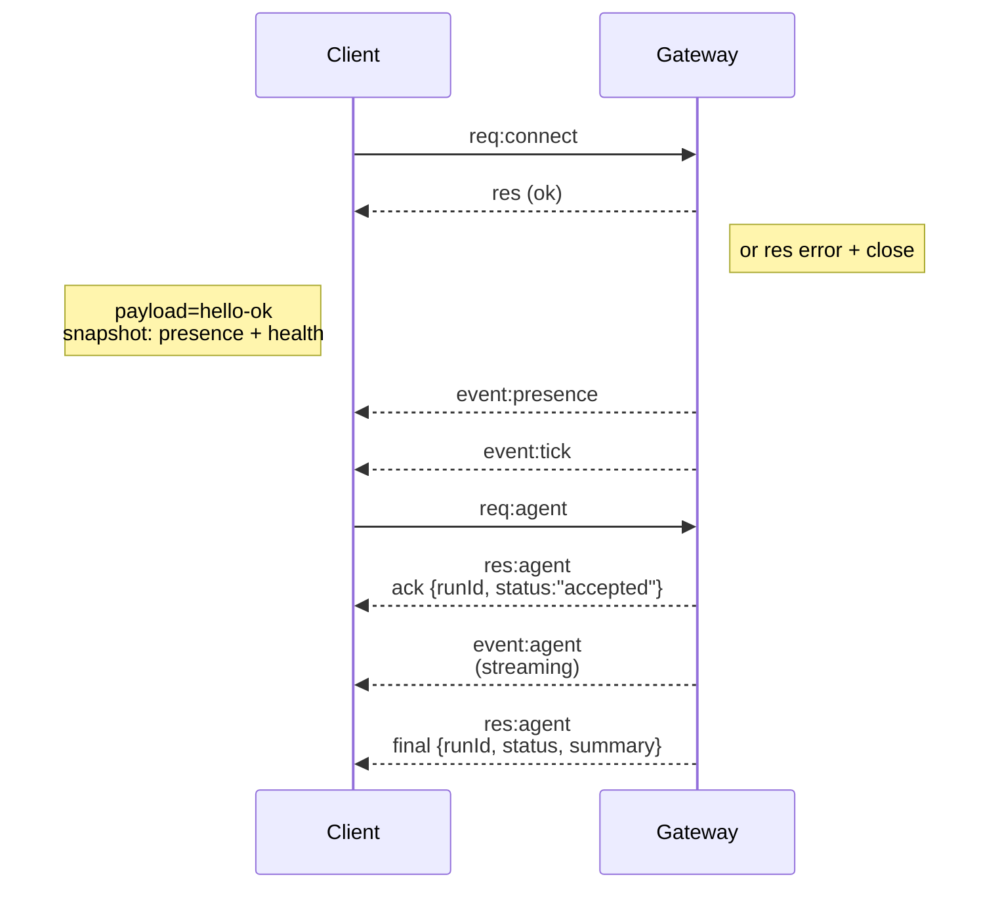

# Gateway 架构

最后更新：2026-01-22

## 概述

- 单个长期运行的 **Gateway** 拥有所有消息界面（WhatsApp via Baileys, Telegram via grammY, Slack, Discord, Signal, iMessage, WebChat）。
- 控制平面客户端（macOS 应用、CLI、web UI、自动化）通过 **WebSocket** 连接到 Gateway，连接位于配置的绑定主机（默认 `127.0.0.1:18789`）。
- **Nodes**（macOS/iOS/Android/headless）也通过 **WebSocket** 连接，但声明 `role: node` 及明确的 caps/commands。
- 每台主机一个 Gateway；它是唯一打开 WhatsApp 会话的地方。
- **canvas host** 由 Gateway HTTP 服务器在以下路径提供：
  - `/__openclaw__/canvas/`（agent 可编辑的 HTML/CSS/JS）
  - `/__openclaw__/a2ui/`（A2UI host）
    它使用与 Gateway 相同的端口（默认 `18789`）。

## 组件和流程

### Gateway（守护进程）

- 维护提供商连接。
- 暴露类型化的 WS API（请求、响应、服务器推送事件）。
- 根据 JSON Schema 验证入站帧。
- 发出事件，如 `agent`、`chat`、`presence`、`health`、`heartbeat`、`cron`。

### 客户端（mac 应用 / CLI / web 管理）

- 每个客户端一个 WS 连接。
- 发送请求（`health`、`status`、`send`、`agent`、`system-presence`）。
- 订阅事件（`tick`、`agent`、`presence`、`shutdown`）。

### Nodes（macOS / iOS / Android / headless）

- 使用 `role: node` 连接到 **同一 WS 服务器**。
- 在 `connect` 中提供设备身份；配对是 **基于设备的**（角色 `node`），批准存在于设备配对存储中。
- 暴露命令，如 `canvas.*`、`camera.*`、`screen.record`、`location.get`。

协议详情：

- [Gateway 协议](/gateway/protocol)

### WebChat

- 静态 UI，使用 Gateway WS API 获取聊天历史并发送消息。
- 在远程设置中，通过与其他客户端相同的 SSH/Tailscale 隧道连接。

## 连接生命周期（单个客户端）



## 通信协议（摘要）

- 传输：WebSocket，带有 JSON 负载的文本帧。
- 第一帧 **必须** 是 `connect`。
- 握手后：
  - 请求：`{type:"req", id, method, params}` → `{type:"res", id, ok, payload|error}`
  - 事件：`{type:"event", event, payload, seq?, stateVersion?}`
- 如果设置了 `OPENCLAW_GATEWAY_TOKEN`（或 `--token`），`connect.params.auth.token` 必须匹配，否则 socket 关闭。
- 幂等键是侧效方法（`send`、`agent`）安全重试所必需的；服务器保留一个短生命周期的去重缓存。
- Nodes 必须在 `connect` 中包含 `role: "node"` 以及 caps/commands/permissions。

## 配对 + 本地信任

- 所有 WS 客户端（operators + nodes）在 `connect` 上包含 **设备身份**。
- 新设备 ID 需要配对批准；Gateway 为后续连接发出 **设备令牌**。
- **本地** 连接（loopback 或 gateway 主机自己的 tailnet 地址）可以自动批准，以保持同主机 UX 流畅。
- 所有连接必须签名 `connect.challenge` nonce。
- 签名负载 `v3` 还绑定 `platform` + `deviceFamily`；gateway 在重连时固定配对的元数据，并要求元数据更改时进行修复配对。
- **非本地** 连接仍然需要明确批准。
- Gateway 认证（`gateway.auth.*`）仍然适用于 **所有** 连接，无论是本地还是远程。

详情：[Gateway 协议](/gateway/protocol)、[配对](/channels/pairing)、[安全](/gateway/security)。

## 协议类型化和代码生成

- TypeBox schemas 定义协议。
- JSON Schema 从这些 schemas 生成。
- Swift 模型从 JSON Schema 生成。

## 远程访问

- 首选：Tailscale 或 VPN。
- 备选：SSH 隧道

  ```bash
  ssh -N -L 18789:127.0.0.1:18789 user@host
  ```

- 相同的握手 + 认证令牌适用于隧道。
- 在远程设置中，可以为 WS 启用 TLS + 可选 pinning。

## 操作快照

- 启动：`openclaw gateway`（前台，日志输出到 stdout）。
- 健康：`health` 通过 WS（也包含在 `hello-ok` 中）。
- 监督：launchd/systemd 用于自动重启。

## 不变量

- 每台主机恰好一个 Gateway 控制单个 Baileys 会话。
- 握手是强制性的；任何非 JSON 或非 connect 第一帧都是硬关闭。
- 事件不会重放；客户端必须在间隙时刷新。