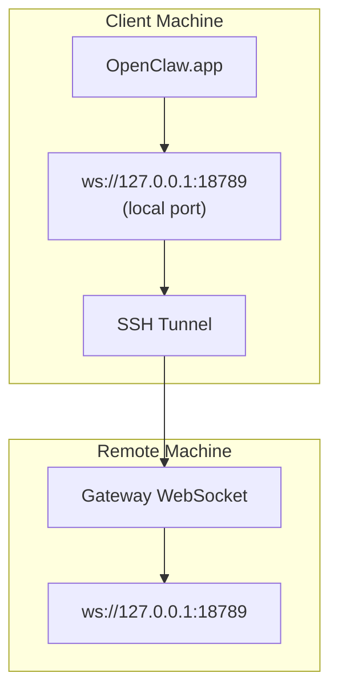

# 使用远程网关运行 OpenClaw.app

OpenClaw.app 使用 SSH 隧道连接到远程网关。本指南将向您展示如何设置。

## 概述



## 快速设置

### 步骤 1：添加 SSH 配置

编辑 `~/.ssh/config` 并添加：

```ssh
Host remote-gateway
    HostName <REMOTE_IP>          # e.g., 172.27.187.184
    User <REMOTE_USER>            # e.g., jefferson
    LocalForward 18789 127.0.0.1:18789
    IdentityFile ~/.ssh/id_rsa
```

将 `<REMOTE_IP>` 和 `<REMOTE_USER>` 替换为您的值。

### 步骤 2：复制 SSH 密钥

将您的公钥复制到远程机器（输入密码一次）：

```bash
ssh-copy-id -i ~/.ssh/id_rsa <REMOTE_USER>@<REMOTE_IP>
```

### 步骤 3：设置网关令牌

```bash
launchctl setenv OPENCLAW_GATEWAY_TOKEN "<your-token>"
```

### 步骤 4：启动 SSH 隧道

```bash
ssh -N remote-gateway &
```

### 步骤 5：重启 OpenClaw.app

```bash
# Quit OpenClaw.app (⌘Q), then reopen:
open /path/to/OpenClaw.app
```

应用程序现在将通过 SSH 隧道连接到远程网关。

---

## 登录时自动启动隧道

要使 SSH 隧道在您登录时自动启动，请创建一个 Launch Agent。

### 创建 PLIST 文件

将其保存为 `~/Library/LaunchAgents/bot.molt.ssh-tunnel.plist`：

```xml
<?xml version="1.0" encoding="UTF-8"?>
<!DOCTYPE plist PUBLIC "-//Apple//DTD PLIST 1.0//EN" "http://www.apple.com/DTDs/PropertyList-1.0.dtd">
<plist version="1.0">
<dict>
    <key>Label</key>
    <string>bot.molt.ssh-tunnel</string>
    <key>ProgramArguments</key>
    <array>
        <string>/usr/bin/ssh</string>
        <string>-N</string>
        <string>remote-gateway</string>
    </array>
    <key>KeepAlive</key>
    <true/>
    <key>RunAtLoad</key>
    <true/>
</dict>
</plist>
```

### 加载 Launch Agent

```bash
launchctl bootstrap gui/$UID ~/Library/LaunchAgents/bot.molt.ssh-tunnel.plist
```

隧道现在将：

- 在您登录时自动启动
- 如果崩溃则自动重启
- 在后台持续运行

旧版注意事项：如果存在，请移除任何遗留的 `com.openclaw.ssh-tunnel` LaunchAgent。

---

## 故障排除

**检查隧道是否正在运行：**

```bash
ps aux | grep "ssh -N remote-gateway" | grep -v grep
lsof -i :18789
```

**重启隧道：**

```bash
launchctl kickstart -k gui/$UID/bot.molt.ssh-tunnel
```

**停止隧道：**

```bash
launchctl bootout gui/$UID/bot.molt.ssh-tunnel
```

---

## 工作原理

| 组件                            | 功能描述                                                 |
| ------------------------------------ | ------------------------------------------------------------ |
| `LocalForward 18789 127.0.0.1:18789` | 将本地端口 18789 转发到远程端口 18789               |
| `ssh -N`                             | 仅进行端口转发而不执行远程命令 |
| `KeepAlive`                          | 如果隧道崩溃则自动重启                  |
| `RunAtLoad`                          | 当代理加载时启动隧道                           |

OpenClaw.app 连接到您客户端机器上的 `ws://127.0.0.1:18789`。SSH 隧道将该连接转发到远程机器上运行网关的端口 18789。