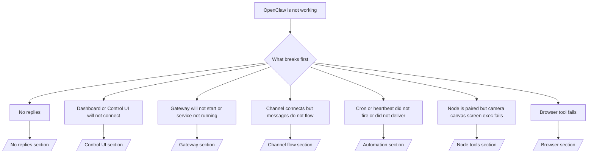

# 故障排除

如果您只有 2 分钟时间，请将本页面用作初步排查的入口。

## 前 60 秒

请严格按以下顺序执行此检查流程：

```bash
openclaw status
openclaw status --all
openclaw gateway probe
openclaw gateway status
openclaw doctor
openclaw channels status --probe
openclaw logs --follow
```

理想的一行输出结果如下：

- `openclaw status` → 显示已配置的通道，且无明显认证错误。
- `openclaw status --all` → 完整报告已生成，可共享。
- `openclaw gateway probe` → 预期的网关目标可达。
- `openclaw gateway status` → `Runtime: running` 和 `RPC probe: ok`。
- `openclaw doctor` → 无阻塞性的配置/服务错误。
- `openclaw channels status --probe` → 通道报告为 `connected` 或 `ready`。
- `openclaw logs --follow` → 活动稳定，无重复出现的严重错误。

## Anthropic 长上下文 429 错误

如果看到：
`HTTP 429: rate_limit_error: Extra usage is required for long context requests`，
请前往 [/gateway/troubleshooting#anthropic-429-extra-usage-required-for-long-context](/gateway/troubleshooting#anthropic-429-extra-usage-required-for-long-context)。

## 插件安装失败：缺少 openclaw 扩展

如果安装因 `package.json missing openclaw.extensions` 失败，则说明该插件包使用了 OpenClaw 当前不再接受的旧格式。

请在插件包中进行如下修复：

1. 在 `package.json` 中添加 `openclaw.extensions`。
2. 将入口点指向已构建的运行时文件（通常为 `./dist/index.js`）。
3. 重新发布插件，并再次运行 `openclaw plugins install <npm-spec>`。

示例：

```json
{
  "name": "@openclaw/my-plugin",
  "version": "1.2.3",
  "openclaw": {
    "extensions": ["./dist/index.js"]
  }
}
```

参考文档：[/tools/plugin#distribution-npm](/tools/plugin#distribution-npm)

## 决策树



<AccordionGroup>
  <Accordion title="No replies">
    __CODE_BLOCK_20__

    Good output looks like:

    - __CODE_BLOCK_21__
    - __CODE_BLOCK_22__
    - Your channel shows connected/ready in __CODE_BLOCK_23__
    - Sender appears approved (or DM policy is open/allowlist)

    Common log signatures:

    - __CODE_BLOCK_24__ → mention gating blocked the message in Discord.
    - __CODE_BLOCK_25__ → sender is unapproved and waiting for DM pairing approval.
    - __CODE_BLOCK_26__ / __CODE_BLOCK_27__ in channel logs → sender, room, or group is filtered.

    Deep pages:

    - [/gateway/troubleshooting#no-replies](/gateway/troubleshooting#no-replies)
    - [/channels/troubleshooting](/channels/troubleshooting)
    - [/channels/pairing](/channels/pairing)

  </Accordion>

  <Accordion title="Dashboard or Control UI will not connect">
    __CODE_BLOCK_28__

    Good output looks like:

    - __CODE_BLOCK_29__ is shown in __CODE_BLOCK_30__
    - __CODE_BLOCK_31__
    - No auth loop in logs

    Common log signatures:

    - __CODE_BLOCK_32__ → HTTP/non-secure context cannot complete device auth.
    - __CODE_BLOCK_33__ / reconnect loop → wrong token/password or auth mode mismatch.
    - __CODE_BLOCK_34__ → UI is targeting the wrong URL/port or unreachable gateway.

    Deep pages:

    - [/gateway/troubleshooting#dashboard-control-ui-connectivity](/gateway/troubleshooting#dashboard-control-ui-connectivity)
    - [/web/control-ui](/web/control-ui)
    - [/gateway/authentication](/gateway/authentication)

  </Accordion>

  <Accordion title="Gateway will not start or service installed but not running">
    __CODE_BLOCK_35__

    Good output looks like:

    - __CODE_BLOCK_36__
    - __CODE_BLOCK_37__
    - __CODE_BLOCK_38__

    Common log signatures:

    - __CODE_BLOCK_39__ → gateway mode is unset/remote.
    - __CODE_BLOCK_40__ → non-loopback bind without token/password.
    - __CODE_BLOCK_41__ or __CODE_BLOCK_42__ → port already taken.

    Deep pages:

    - [/gateway/troubleshooting#gateway-service-not-running](/gateway/troubleshooting#gateway-service-not-running)
    - [/gateway/background-process](/gateway/background-process)
    - [/gateway/configuration](/gateway/configuration)

  </Accordion>

  <Accordion title="Channel connects but messages do not flow">
    __CODE_BLOCK_43__

    Good output looks like:

    - Channel transport is connected.
    - Pairing/allowlist checks pass.
    - Mentions are detected where required.

    Common log signatures:

    - __CODE_BLOCK_44__ → group mention gating blocked processing.
    - __CODE_BLOCK_45__ / __CODE_BLOCK_46__ → DM sender is not approved yet.
    - __CODE_BLOCK_47__, __CODE_BLOCK_48__, __CODE_BLOCK_49__, __CODE_BLOCK_50__ → channel permission token issue.

    Deep pages:

    - [/gateway/troubleshooting#channel-connected-messages-not-flowing](/gateway/troubleshooting#channel-connected-messages-not-flowing)
    - [/channels/troubleshooting](/channels/troubleshooting)

  </Accordion>

  <Accordion title="Cron or heartbeat did not fire or did not deliver">
    __CODE_BLOCK_51__

    Good output looks like:

    - __CODE_BLOCK_52__ shows enabled with a next wake.
    - __CODE_BLOCK_53__ shows recent __CODE_BLOCK_54__ entries.
    - Heartbeat is enabled and not outside active hours.

    Common log signatures:

    - __CODE_BLOCK_55__ → cron is disabled.
    - __CODE_BLOCK_56__ with __CODE_BLOCK_57__ → outside configured active hours.
    - __CODE_BLOCK_58__ → main lane busy; heartbeat wake was deferred.
    - __CODE_BLOCK_59__ → heartbeat delivery target account does not exist.

    Deep pages:

    - [/gateway/troubleshooting#cron-and-heartbeat-delivery](/gateway/troubleshooting#cron-and-heartbeat-delivery)
    - [/automation/troubleshooting](/automation/troubleshooting)
    - [/gateway/heartbeat](/gateway/heartbeat)

  </Accordion>

  <Accordion title="Node is paired but tool fails camera canvas screen exec">
    __CODE_BLOCK_60__

    Good output looks like:

    - Node is listed as connected and paired for role __CODE_BLOCK_61__.
    - Capability exists for the command you are invoking.
    - Permission state is granted for the tool.

    Common log signatures:

    - __CODE_BLOCK_62__ → bring node app to foreground.
    - __CODE_BLOCK_63__ → OS permission was denied/missing.
    - __CODE_BLOCK_64__ → exec approval is pending.
    - __CODE_BLOCK_65__ → command not on exec allowlist.

    Deep pages:

    - [/gateway/troubleshooting#node-paired-tool-fails](/gateway/troubleshooting#node-paired-tool-fails)
    - [/nodes/troubleshooting](/nodes/troubleshooting)
    - [/tools/exec-approvals](/tools/exec-approvals)

  </Accordion>

  <Accordion title="Browser tool fails">
    __CODE_BLOCK_66__

    Good output looks like:

    - Browser status shows __CODE_BLOCK_67__ and a chosen browser/profile.
    - __CODE_BLOCK_68__ profile starts or __CODE_BLOCK_69__ relay has an attached tab.

    Common log signatures:

    - __CODE_BLOCK_70__ → local browser launch failed.
    - __CODE_BLOCK_71__ → configured binary path is wrong.
    - __CODE_BLOCK_72__ → extension not attached.
    - __CODE_BLOCK_73__ → attach-only profile has no live CDP target.

    Deep pages:

    - [/gateway/troubleshooting#browser-tool-fails](/gateway/troubleshooting#browser-tool-fails)
    - [/tools/browser-linux-troubleshooting](/tools/browser-linux-troubleshooting)
    - [/tools/chrome-extension](/tools/chrome-extension)

  </Accordion>
</AccordionGroup>