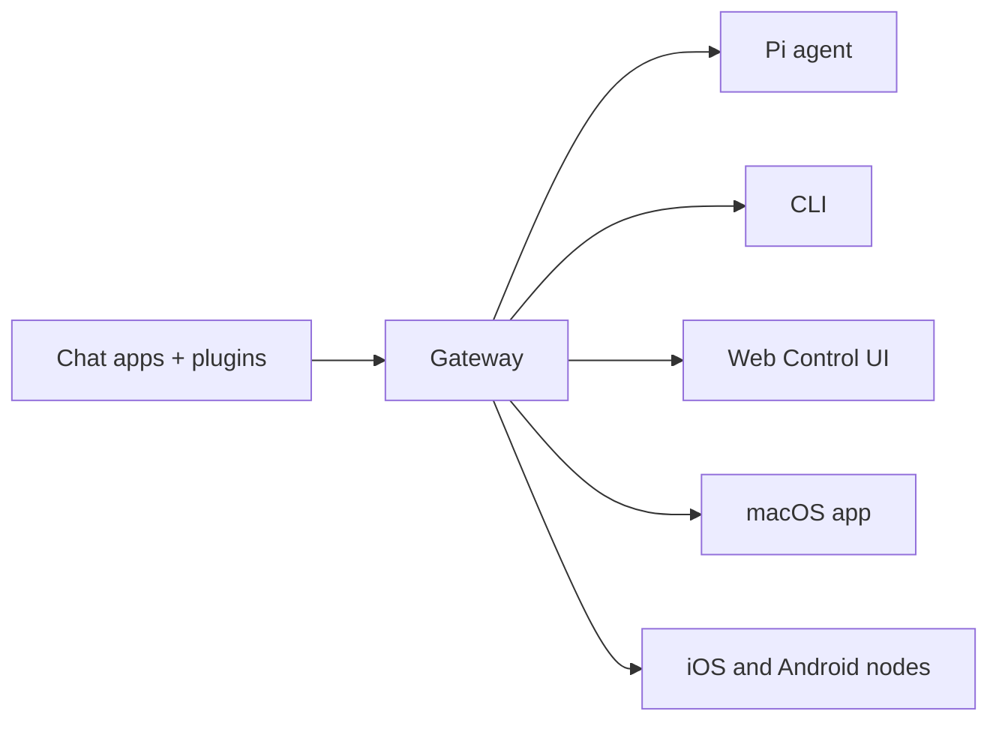

# OpenClaw 🦞

<p align="center">
    
    
</p>

> _"脱皮！脱皮！"_ — 一只太空龙虾，大概

<p align="center">
  <strong>Any OS gateway for AI agents across Discord, Google Chat, iMessage, Matrix, Microsoft Teams, Signal, Slack, Telegram, WhatsApp, Zalo, and more.</strong><br />
  发送消息，从口袋中获取 Agent 响应。运行一个 Gateway，覆盖内置 Channel、捆绑 Channel 插件、WebChat 和 Mobile Nodes。
</p>

<Columns>
  <Card title="Get Started" href="/start/getting-started" icon="rocket">
    Install OpenClaw and bring up the Gateway in minutes.
  </Card>
  <Card title="Run Onboarding" href="/start/wizard" icon="sparkles">
    Guided setup with __CODE_BLOCK_0__ and pairing flows.
  </Card>
  <Card title="Open the Control UI" href="/web/control-ui" icon="layout-dashboard">
    Launch the browser dashboard for chat, config, and sessions.
  </Card>
</Columns>

## 什么是 OpenClaw？

OpenClaw 是一个**自托管 Gateway**，连接你的首选聊天应用和 Channel 表面——内置 Channel 加上捆绑或外部 Channel 插件，例如 Discord, Google Chat, iMessage, Matrix, Microsoft Teams, Signal, Slack, Telegram, WhatsApp, Zalo，以及更多——到 AI Coding Agent 如 Pi。你在自己的机器（或服务器）上运行单个 Gateway 进程，它成为你的消息应用与始终可用的 AI 助手之间的桥梁。

**目标用户？** 开发者及高级用户，他们希望拥有个人 AI 助手，随时随地可发消息 —— 无需放弃数据控制权或依赖托管服务。

**有何不同？**

- **自托管**：在你的硬件上运行，遵循你的规则
- **多 Channel**：一个 Gateway 同时服务于内置 Channel 以及捆绑或外部 Channel 插件
- **Agent 原生**：为 Coding Agent 构建，支持工具使用、Session、Memory 和 Multi-Agent 路由
- **开源**：MIT 许可，社区驱动

**你需要什么？** Node 24（推荐），或 Node 22 LTS (`22.14+`) 用于兼容性，来自你选择提供商的 API key，以及 5 分钟时间。为了最佳质量和安全，请使用可用的最强最新一代 Model。

## 工作原理



Gateway 是 Session、路由和 Channel 连接的单一事实来源。

## 核心功能

<Columns>
  <Card title="Multi-channel gateway" icon="network">
    Discord, iMessage, Signal, Slack, Telegram, WhatsApp, WebChat, and more with a single Gateway process.
  </Card>
  <Card title="Plugin channels" icon="plug">
    Bundled plugins add Matrix, Nostr, Twitch, Zalo, and more in normal current releases.
  </Card>
  <Card title="Multi-agent routing" icon="route">
    Isolated sessions per agent, workspace, or sender.
  </Card>
  <Card title="Media support" icon="image">
    Send and receive images, audio, and documents.
  </Card>
  <Card title="Web Control UI" icon="monitor">
    Browser dashboard for chat, config, sessions, and nodes.
  </Card>
  <Card title="Mobile nodes" icon="smartphone">
    Pair iOS and Android nodes for Canvas, camera, and voice-enabled workflows.
  </Card>
</Columns>

## 快速开始

<Steps>
  <Step title="Install OpenClaw">
    __CODE_BLOCK_3__
  </Step>
  <Step title="Onboard and install the service">
    __CODE_BLOCK_4__
  </Step>
  <Step title="Chat">
    Open the Control UI in your browser and send a message:

    __CODE_BLOCK_5__

    Or connect a channel ([Telegram](/channels/telegram) is fastest) and chat from your phone.

  </Step>
</Steps>

需要完整的安装和开发设置？请查看 [Getting Started](/start/getting-started)。

## 仪表盘

Gateway 启动后，打开浏览器中的 Control UI。

- 本地默认：[http://127.0.0.1:18789/](http://127.0.0.1:18789/)
- 远程访问：[Web 界面](/web) 和 [Tailscale](/gateway/tailscale)

<p align="center">
  
</p>

## 配置（可选）

配置文件位于 `~/.openclaw/openclaw.json`。

- 如果你**什么都不做**，OpenClaw 将使用捆绑的 Pi binary，以 RPC 模式运行，并带有 per-sender Session。
- 如果你想锁定它，从 `channels.whatsapp.allowFrom` 开始，并（针对群组）提及规则。

示例：

```json5
{
  channels: {
    whatsapp: {
      allowFrom: ["+15555550123"],
      groups: { "*": { requireMention: true } },
    },
  },
  messages: { groupChat: { mentionPatterns: ["@openclaw"] } },
}
```

## 从这里开始

<Columns>
  <Card title="Docs hubs" href="/start/hubs" icon="book-open">
    All docs and guides, organized by use case.
  </Card>
  <Card title="Configuration" href="/gateway/configuration" icon="settings">
    Core Gateway settings, tokens, and provider config.
  </Card>
  <Card title="Remote access" href="/gateway/remote" icon="globe">
    SSH and tailnet access patterns.
  </Card>
  <Card title="Channels" href="/channels/telegram" icon="message-square">
    Channel-specific setup for Feishu, Microsoft Teams, WhatsApp, Telegram, Discord, and more.
  </Card>
  <Card title="Nodes" href="/nodes" icon="smartphone">
    iOS and Android nodes with pairing, Canvas, camera, and device actions.
  </Card>
  <Card title="Help" href="/help" icon="life-buoy">
    Common fixes and troubleshooting entry point.
  </Card>
</Columns>

## 了解更多

<Columns>
  <Card title="Full feature list" href="/concepts/features" icon="list">
    Complete channel, routing, and media capabilities.
  </Card>
  <Card title="Multi-agent routing" href="/concepts/multi-agent" icon="route">
    Workspace isolation and per-agent sessions.
  </Card>
  <Card title="Security" href="/gateway/security" icon="shield">
    Tokens, allowlists, and safety controls.
  </Card>
  <Card title="Troubleshooting" href="/gateway/troubleshooting" icon="wrench">
    Gateway diagnostics and common errors.
  </Card>
  <Card title="About and credits" href="/reference/credits" icon="info">
    Project origins, contributors, and license.
  </Card>
</Columns>