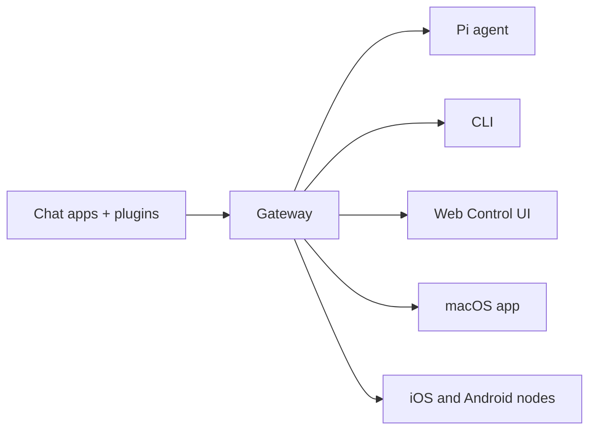

# OpenClaw 🦞

<p align="center">
    
    
</p>

> _“剥离！剥离！”_ —— 一只太空龙虾，大概吧

<p align="center">
  <strong>Any OS gateway for AI agents across WhatsApp, Telegram, Discord, iMessage, and more.</strong><br />
  发送消息，从你的口袋里获取代理响应。插件支持 Mattermost 等更多服务。
</p>

<Columns>
  <Card title="Get Started" href="/start/getting-started" icon="rocket">
    Install OpenClaw and bring up the Gateway in minutes.
  </Card>
  <Card title="Run the Wizard" href="/start/wizard" icon="sparkles">
    Guided setup with __CODE_BLOCK_0__ and pairing flows.
  </Card>
  <Card title="Open the Control UI" href="/web/control-ui" icon="layout-dashboard">
    Launch the browser dashboard for chat, config, and sessions.
  </Card>
</Columns>

## 什么是 OpenClaw？

OpenClaw 是一个**自托管网关**，它将您最喜欢的聊天应用（如 WhatsApp、Telegram、Discord、iMessage 等）连接到 AI 编码代理（如 Pi）。您在自己的机器（或服务器）上运行单个 Gateway 进程，它成为您的消息应用与始终可用的 AI 助手之间的桥梁。

**它是为谁设计的？** 希望随时随地通过消息联系个人 AI 助手的开发者和高级用户——无需放弃数据控制权或依赖托管服务。

**它的不同之处在哪里？**

- **自托管**：在您的硬件上运行，遵循您的规则
- **多通道**：一个网关同时服务于 WhatsApp、Telegram、Discord 等
- **原生代理**：专为编码代理构建，支持工具使用、会话、记忆和多智能体路由
- **开源**：MIT 许可，由社区驱动

**您需要什么？** Node 22+、来自所选提供商的 API key，以及 5 分钟时间。为了获得最佳质量和安全性，请使用可用的最强最新一代模型。

## 工作原理



网关是会话、路由和频道连接的唯一事实来源。

## 核心功能

<Columns>
  <Card title="Multi-channel gateway" icon="network">
    WhatsApp, Telegram, Discord, and iMessage with a single Gateway process.
  </Card>
  <Card title="Plugin channels" icon="plug">
    Add Mattermost and more with extension packages.
  </Card>
  <Card title="Multi-agent routing" icon="route">
    Isolated sessions per agent, workspace, or sender.
  </Card>
  <Card title="Media support" icon="image">
    Send and receive images, audio, and documents.
  </Card>
  <Card title="Web Control UI" icon="monitor">
    Browser dashboard for chat, config, sessions, and nodes.
  </Card>
  <Card title="Mobile nodes" icon="smartphone">
    Pair iOS and Android nodes for Canvas, camera/screen, and voice-enabled workflows.
  </Card>
</Columns>

## 快速开始

<Steps>
  <Step title="Install OpenClaw">
    __CODE_BLOCK_2__
  </Step>
  <Step title="Onboard and install the service">
    __CODE_BLOCK_3__
  </Step>
  <Step title="Pair WhatsApp and start the Gateway">
    __CODE_BLOCK_4__
  </Step>
</Steps>

需要完整的安装和开发环境设置吗？请参阅 [快速开始](/start/quickstart)。

## 仪表盘

Gateway 启动后打开浏览器控制面板 UI。

- 本地默认：[http://127.0.0.1:18789/](http://127.0.0.1:18789/)
- 远程访问：[Web 界面](/web) 和 [Tailscale](/gateway/tailscale)

<p align="center">
  
</p>

## 配置（可选）

配置文件位于 `~/.openclaw/openclaw.json`。

- 如果您**什么都不做**，OpenClaw 将使用捆绑的 Pi 二进制文件以 RPC 模式运行，并带有每个发送者的会话。
- 如果您想锁定配置，请从 `channels.whatsapp.allowFrom` 开始，并对（群组）提及规则。

示例：

```json5
{
  channels: {
    whatsapp: {
      allowFrom: ["+15555550123"],
      groups: { "*": { requireMention: true } },
    },
  },
  messages: { groupChat: { mentionPatterns: ["@openclaw"] } },
}
```

## 从这里开始

<Columns>
  <Card title="Docs hubs" href="/start/hubs" icon="book-open">
    All docs and guides, organized by use case.
  </Card>
  <Card title="Configuration" href="/gateway/configuration" icon="settings">
    Core Gateway settings, tokens, and provider config.
  </Card>
  <Card title="Remote access" href="/gateway/remote" icon="globe">
    SSH and tailnet access patterns.
  </Card>
  <Card title="Channels" href="/channels/telegram" icon="message-square">
    Channel-specific setup for WhatsApp, Telegram, Discord, and more.
  </Card>
  <Card title="Nodes" href="/nodes" icon="smartphone">
    iOS and Android nodes with pairing, Canvas, camera/screen, and device actions.
  </Card>
  <Card title="Help" href="/help" icon="life-buoy">
    Common fixes and troubleshooting entry point.
  </Card>
</Columns>

## 了解更多

<Columns>
  <Card title="Full feature list" href="/concepts/features" icon="list">
    Complete channel, routing, and media capabilities.
  </Card>
  <Card title="Multi-agent routing" href="/concepts/multi-agent" icon="route">
    Workspace isolation and per-agent sessions.
  </Card>
  <Card title="Security" href="/gateway/security" icon="shield">
    Tokens, allowlists, and safety controls.
  </Card>
  <Card title="Troubleshooting" href="/gateway/troubleshooting" icon="wrench">
    Gateway diagnostics and common errors.
  </Card>
  <Card title="About and credits" href="/reference/credits" icon="info">
    Project origins, contributors, and license.
  </Card>
</Columns>