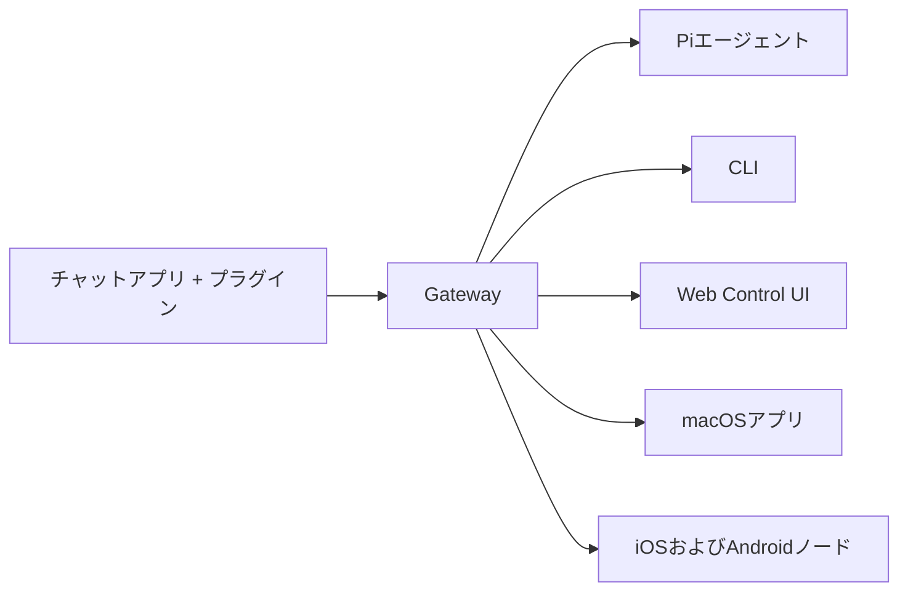

---
read_when:
  - 新規ユーザーにOpenClawを紹介するとき
summary: OpenClawは、あらゆるOSで動作するAIエージェント向けのマルチチャネルgatewayです。
title: OpenClaw
x-i18n:
  generated_at: "2026-02-08T17:15:47Z"
  model: claude-opus-4-6
  provider: pi
  source_hash: fc8babf7885ef91d526795051376d928599c4cf8aff75400138a0d7d9fa3b75f
  source_path: index.md
  workflow: 15
---
# OpenClaw 🦞

<p align="center">
    
    
</p>

> _「剥离！剥离！」_ — 大概是一只宇宙龙虾

<p align="center">
  <strong>WhatsApp、Telegram、Discord、iMessageなどに対応した、あらゆるOS向けのAIエージェントgateway。</strong><br />
  发送消息后，即可从口袋中接收 Agent 的响应。可通过插件添加 Mattermost 等功能。
</p>

<Columns>
  <Card title="はじめに" href="/start/getting-started" icon="rocket">
    OpenClawをインストールし、数分でGatewayを起動できます。
  </Card>
  <Card title="ウィザードを実行" href="/start/wizard" icon="sparkles">
    __CODE_BLOCK_0__とペアリングフローによるガイド付きセットアップ。
  </Card>
  <Card title="Control UIを開く" href="/web/control-ui" icon="layout-dashboard">
    チャット、設定、セッション用のブラウザダッシュボードを起動します。
  </Card>
</Columns>

OpenClaw 通过单个 Gateway 进程将聊天应用连接到像 Pi 这样的编码 Agent。驱动 OpenClaw Assistant，支持本地或远程设置。

## 工作原理



Gateway 是会话、路由和通道连接的可靠单一信息源。

## 主要功能

<Columns>
  <Card title="マルチチャネルgateway" icon="network">
    単一のGatewayプロセスでWhatsApp、Telegram、Discord、iMessageに対応。
  </Card>
  <Card title="プラグインチャネル" icon="plug">
    拡張パッケージでMattermostなどを追加。
  </Card>
  <Card title="マルチエージェントルーティング" icon="route">
    エージェント、ワークスペース、送信者ごとに分離されたセッション。
  </Card>
  <Card title="メディアサポート" icon="image">
    画像、音声、ドキュメントの送受信。
  </Card>
  <Card title="Web Control UI" icon="monitor">
    チャット、設定、セッション、ノード用のブラウザダッシュボード。
  </Card>
  <Card title="モバイルノード" icon="smartphone">
    Canvas対応のiOSおよびAndroidノードをペアリング。
  </Card>
</Columns>

## 快速开始

<Steps>
  <Step title="OpenClawをインストール">
    __CODE_BLOCK_2__
  </Step>
  <Step title="オンボーディングとサービスのインストール">
    __CODE_BLOCK_3__
  </Step>
  <Step title="WhatsAppをペアリングしてGatewayを起動">
    __CODE_BLOCK_4__
  </Step>
</Steps>

需要完整的安装和开发设置吗？请查看 [快速开始](/start/quickstart)。

## 仪表盘

启动 Gateway 后，在浏览器中打开 Control UI。

- 本地默认：[http://127.0.0.1:18789/](http://127.0.0.1:18789/)
- 远程访问：[Web 界面](/web) 和 [Tailscale](/gateway/tailscale)

<p align="center">
  
</p>

## 配置（可选）

配置位于 `~/.openclaw/openclaw.json` 中。

- **如果不做任何操作**，OpenClaw 将使用捆绑的 Pi 二进制文件以 RPC 模式运行，并为每个发送者创建会话。
- 如果您想设置限制，请从 `channels.whatsapp.allowFrom` 和（针对群组）提及规则开始。

示例：

```json5
{
  channels: {
    whatsapp: {
      allowFrom: ["+15555550123"],
      groups: { "*": { requireMention: true } },
    },
  },
  messages: { groupChat: { mentionPatterns: ["@openclaw"] } },
}
```

## 从这里开始

<Columns>
  <Card title="ドキュメントハブ" href="/start/hubs" icon="book-open">
    ユースケース別に整理されたすべてのドキュメントとガイド。
  </Card>
  <Card title="設定" href="/gateway/configuration" icon="settings">
    Gatewayのコア設定、トークン、プロバイダー設定。
  </Card>
  <Card title="リモートアクセス" href="/gateway/remote" icon="globe">
    SSHおよびtailnetアクセスパターン。
  </Card>
  <Card title="チャネル" href="/channels/telegram" icon="message-square">
    WhatsApp、Telegram、Discordなどのチャネル固有のセットアップ。
  </Card>
  <Card title="ノード" href="/nodes" icon="smartphone">
    ペアリングとCanvas対応のiOSおよびAndroidノード。
  </Card>
  <Card title="ヘルプ" href="/help" icon="life-buoy">
    一般的な修正とトラブルシューティングのエントリーポイント。
  </Card>
</Columns>

## 详情

<Columns>
  <Card title="全機能リスト" href="/concepts/features" icon="list">
    チャネル、ルーティング、メディア機能の完全な一覧。
  </Card>
  <Card title="マルチエージェントルーティング" href="/concepts/multi-agent" icon="route">
    ワークスペースの分離とエージェントごとのセッション。
  </Card>
  <Card title="セキュリティ" href="/gateway/security" icon="shield">
    トークン、許可リスト、安全制御。
  </Card>
  <Card title="トラブルシューティング" href="/gateway/troubleshooting" icon="wrench">
    Gatewayの診断と一般的なエラー。
  </Card>
  <Card title="概要とクレジット" href="/reference/credits" icon="info">
    プロジェクトの起源、貢献者、ライセンス。
  </Card>
</Columns>