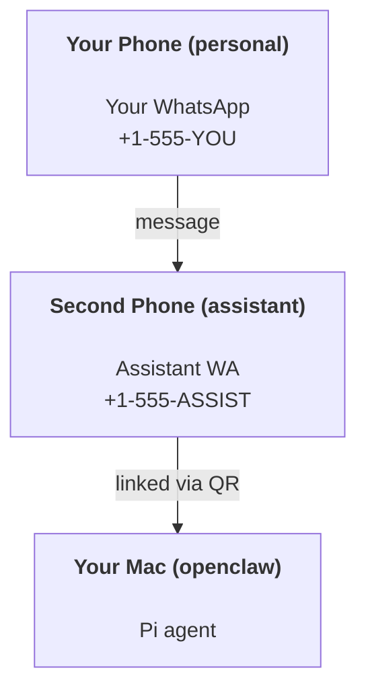

# 使用 OpenClaw 构建个人助理

OpenClaw 是一个面向 **Pi** 智能体的 WhatsApp + Telegram + Discord + iMessage 网关。插件支持添加 Mattermost。本指南是“个人助理”设置：一个专用的 WhatsApp 号码，表现得像您始终在线的智能体。

## ⚠️ 安全第一

您正在将智能体置于以下位置：

- 在您的机器上运行命令（取决于您的 Pi 工具设置）
- 读取/写入您工作区中的文件
- 通过 WhatsApp/Telegram/Discord/Mattermost（插件）发送消息回传

保守起步：

- 始终设置 `channels.whatsapp.allowFrom`（切勿在您的个人 Mac 上运行对世界开放的服务）。
- 为助理使用专用的 WhatsApp 号码。
- 心跳现在默认为每 30 分钟一次。通过设置 `agents.defaults.heartbeat.every: "0m"` 来禁用，直到您信任该设置。

## 先决条件

- 已安装并入驻 OpenClaw — 如果尚未完成，请参阅 [入门指南](/start/getting-started)
- 用于助理的第二个电话号码（SIM/eSIM/预付卡）

## 双手机设置（推荐）

您希望这样：


```mermaid
flowchart TB
    A["<b>Your Phone (personal)<br></b><br>Your WhatsApp<br>+1-555-YOU"] -- message --> B["<b>Second Phone (assistant)<br></b><br>Assistant WA<br>+1-555-ASSIST"]
    B -- linked via QR --> C["<b>Your Mac (openclaw)<br></b><br>Pi agent"]
```

如果您将个人 WhatsApp 链接到 OpenClaw，每条发给您的消息都会变成“智能体输入”。这通常不是您想要的。

## 5 分钟快速入门

1. 配对 WhatsApp Web（显示二维码；用助理手机扫描）：

```bash
openclaw channels login
```

2. 启动网关（保持运行）：

```bash
openclaw gateway --port 18789
```

3. 在 `~/.openclaw/openclaw.json` 中放入最小化配置：

```json5
{
  channels: { whatsapp: { allowFrom: ["+15555550123"] } },
}
```

现在从您白名单手机向助理号码发送消息。

当入驻完成后，我们会自动打开仪表板并打印一个干净（非 token 化）的链接。如果提示认证，请将 `gateway.auth.token` 中的 token 粘贴到 Control UI 设置中。稍后重新打开：`openclaw dashboard`。

## 给智能体一个工作区 (AGENTS)

OpenClaw 从其工作区目录读取操作指令和“记忆”。

默认情况下，OpenClaw 使用 `~/.openclaw/workspace` 作为智能体工作区，并将在设置/首次智能体运行时自动创建它（以及 starter `AGENTS.md`, `SOUL.md`, `TOOLS.md`, `IDENTITY.md`, `USER.md`, `HEARTBEAT.md`）。`BOOTSTRAP.md` 仅在工作区全新时创建（删除后不应再次出现）。`MEMORY.md` 是可选的（非自动创建）；当存在时，它会被加载到正常会话中。子智能体会话仅注入 `AGENTS.md` 和 `TOOLS.md`。

提示：将此文件夹视为 OpenClaw 的“记忆”，并将其制成 git 仓库（最好是私有的），以便备份您的 `AGENTS.md` + 记忆文件。如果安装了 git，全新工作区将自动初始化。

```bash
openclaw setup
```

完整工作区布局 + 备份指南：[智能体工作区](/concepts/agent-workspace)
记忆工作流：[记忆](/concepts/memory)

可选：使用 `agents.defaults.workspace` 选择不同工作区（支持 `~`）。

```json5
{
  agent: {
    workspace: "~/.openclaw/workspace",
  },
}
```

如果您已经从仓库发布自己的工作区文件，可以完全禁用引导文件创建：

```json5
{
  agent: {
    skipBootstrap: true,
  },
}
```

## 将其转变为“助理”的配置

OpenClaw 默认为良好的助理设置，但您通常希望调整：

- `SOUL.md` 中的人设/指令
- 思考默认值（如果需要）
- 心跳（一旦您信任它）

示例：

```json5
{
  logging: { level: "info" },
  agent: {
    model: "anthropic/claude-opus-4-6",
    workspace: "~/.openclaw/workspace",
    thinkingDefault: "high",
    timeoutSeconds: 1800,
    // Start with 0; enable later.
    heartbeat: { every: "0m" },
  },
  channels: {
    whatsapp: {
      allowFrom: ["+15555550123"],
      groups: {
        "*": { requireMention: true },
      },
    },
  },
  routing: {
    groupChat: {
      mentionPatterns: ["@openclaw", "openclaw"],
    },
  },
  session: {
    scope: "per-sender",
    resetTriggers: ["/new", "/reset"],
    reset: {
      mode: "daily",
      atHour: 4,
      idleMinutes: 10080,
    },
  },
}
```

## 会话和记忆

- 会话文件：`~/.openclaw/agents/<agentId>/sessions/{{SessionId}}.jsonl`
- 会话元数据（token 用量、最后路由等）：`~/.openclaw/agents/<agentId>/sessions/sessions.json`（旧版：`~/.openclaw/sessions/sessions.json`）
- `/new` 或 `/reset` 为该聊天启动全新会话（可通过 `resetTriggers` 配置）。如果单独发送，智能体会回复简短的问候以确认重置。
- `/compact [instructions]` 压缩会话上下文并报告剩余的上下文预算。

## 心跳（主动模式）

默认情况下，OpenClaw 每 30 分钟运行一次心跳，提示语为：
`Read HEARTBEAT.md if it exists (workspace context). Follow it strictly. Do not infer or repeat old tasks from prior chats. If nothing needs attention, reply HEARTBEAT_OK.`
设置 `agents.defaults.heartbeat.every: "0m"` 以禁用。

- 如果 `HEARTBEAT.md` 存在但实际为空（仅包含空行和 markdown 标题如 `# Heading`），OpenClaw 将跳过心跳运行以节省 API 调用。
- 如果文件缺失，心跳仍会运行，由模型决定做什么。
- 如果智能体回复 `HEARTBEAT_OK`（可选带短填充；见 `agents.defaults.heartbeat.ackMaxChars`），OpenClaw 将抑制该心跳的出站交付。
- 默认情况下，允许向 DM 风格 `user:<id>` 目标交付心跳。设置 `agents.defaults.heartbeat.directPolicy: "block"` 以抑制直接目标交付，同时保持心跳运行活跃。
- 心跳运行完整的智能体回合 — 较短的间隔会消耗更多 token。

```json5
{
  agent: {
    heartbeat: { every: "30m" },
  },
}
```

## 媒体输入和输出

入站附件（图片/音频/文档）可以通过模板显示给您的命令：

- `{{MediaPath}}`（本地临时文件路径）
- `{{MediaUrl}}`（伪 URL）
- `{{Transcript}}`（如果启用了音频转录）

来自智能体的出站附件：在其独占行中包含 `MEDIA:<path-or-url>`（无空格）。示例：

```
Here’s the screenshot.
MEDIA:https://example.com/screenshot.png
```

OpenClaw 提取这些内容并将它们作为媒体与文本一起发送。

## 操作清单

```bash
openclaw status          # local status (creds, sessions, queued events)
openclaw status --all    # full diagnosis (read-only, pasteable)
openclaw status --deep   # adds gateway health probes (Telegram + Discord)
openclaw health --json   # gateway health snapshot (WS)
```

日志位于 `/tmp/openclaw/` 下（默认：`openclaw-YYYY-MM-DD.log`）。

## 下一步

- WebChat: [WebChat](/web/webchat)
- 网关操作：[网关操作手册](/gateway)
- Cron + 唤醒：[Cron 任务](/automation/cron-jobs)
- macOS 菜单栏伴侣：[OpenClaw macOS 应用](/platforms/macos)
- iOS node 应用：[iOS 应用](/platforms/ios)
- Android node 应用：[Android 应用](/platforms/android)
- Windows 状态：[Windows (WSL2)](/platforms/windows)
- Linux 状态：[Linux 应用](/platforms/linux)
- 安全：[安全](/gateway/security)