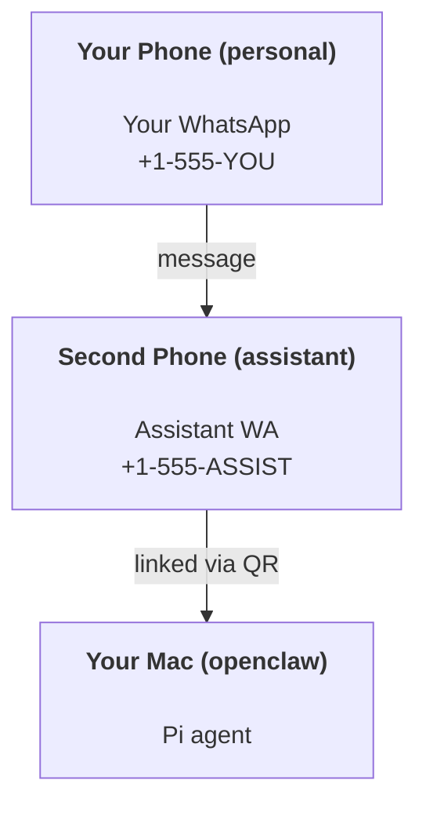

# 使用 OpenClaw 构建个人助理

OpenClaw 是一个面向 **Pi** 智能体的 WhatsApp + Telegram + Discord + iMessage 网关。插件可扩展支持 Mattermost。本指南介绍的是“个人助理”部署方案：一个专用的 WhatsApp 号码，其行为如同始终在线的智能代理。

## ⚠️ 安全第一

您正在将一个智能体置于以下能力范围之内：

- 在您的机器上执行命令（取决于您配置的 Pi 工具）
- 读取/写入工作区中的文件
- 通过 WhatsApp/Telegram/Discord/Mattermost（插件）向外发送消息

请从保守策略开始：

- 务必设置 `channels.whatsapp.allowFrom`（切勿在您的个人 Mac 上运行面向全网开放的服务）。
- 为该助理单独使用一个 WhatsApp 号码。
- 心跳检测默认每 30 分钟触发一次。在您充分信任该配置前，请通过设置 `agents.defaults.heartbeat.every: "0m"` 将其禁用。

## 前置条件

- 已安装并完成 OpenClaw 的初始配置 — 若尚未完成，请参阅 [入门指南](/start/getting-started)
- 一个用于助理的备用手机号（SIM 卡/eSIM/预付费卡）

## 双手机配置（推荐）

您应采用如下结构：


```mermaid
flowchart TB
    A["<b>Your Phone (personal)<br></b><br>Your WhatsApp<br>+1-555-YOU"] -- message --> B["<b>Second Phone (assistant)<br></b><br>Assistant WA<br>+1-555-ASSIST"]
    B -- linked via QR --> C["<b>Your Mac (openclaw)<br></b><br>Pi agent"]
```

若您将个人 WhatsApp 账号绑定至 OpenClaw，则所有发给您的消息都会被当作“代理输入”。这通常并非您所期望的行为。

## 5 分钟快速启动

1. 配对 WhatsApp Web（显示二维码；请用助理手机扫描）：

```bash
openclaw channels login
```

2. 启动网关（保持其持续运行）：

```bash
openclaw gateway --port 18789
```

3. 在 `~/.openclaw/openclaw.json` 中放置一个最小化配置：

```json5
{
  channels: { whatsapp: { allowFrom: ["+15555550123"] } },
}
```

现在，从您已加入白名单的手机向该助理号码发送消息。

初始配置完成后，系统将自动打开控制面板，并打印一条简洁（非令牌化）的访问链接。若提示身份验证，请将 `gateway.auth.token` 中的令牌粘贴至控制界面设置中。如需后续重新打开：`openclaw dashboard`。

## 为智能体分配工作区（AGENTS）

OpenClaw 从其工作区目录中读取操作指令与“记忆”。

默认情况下，OpenClaw 使用 `~/.openclaw/workspace` 作为智能体工作区，并将在首次配置或首次运行智能体时自动创建该目录，以及初始的 `AGENTS.md`、`SOUL.md`、`TOOLS.md`、`IDENTITY.md`、`USER.md` 和 `HEARTBEAT.md` 文件。`BOOTSTRAP.md` 仅在工作区为全新创建时生成（删除后不应再次出现）。`MEMORY.md` 为可选文件（不会自动创建）；若存在，将在常规会话中加载。子智能体会话仅注入 `AGENTS.md` 和 `TOOLS.md`。

提示：请将此文件夹视为 OpenClaw 的“记忆”，并将其设为 Git 仓库（建议设为私有），以便备份您的 `AGENTS.md` 及记忆文件。若已安装 Git，全新工作区将自动完成初始化。

```bash
openclaw setup
```

完整工作区布局及备份指南：[智能体工作区](/concepts/agent-workspace)  
记忆工作流说明：[记忆](/concepts/memory)

可选：通过 `agents.defaults.workspace` 指定其他工作区路径（支持 `~`）。

```json5
{
  agent: {
    workspace: "~/.openclaw/workspace",
  },
}
```

若您已从代码仓库中自行分发工作区文件，可完全禁用引导文件的自动生成：

```json5
{
  agent: {
    skipBootstrap: true,
  },
}
```

## 将其转变为“助理”的配置

OpenClaw 默认已启用良好的助理配置，但您通常仍需调整以下内容：

- `SOUL.md` 中的角色设定/指令
- 思考模式默认值（按需调整）
- 心跳检测（待您充分信任该配置后启用）

示例：

```json5
{
  logging: { level: "info" },
  agent: {
    model: "anthropic/claude-opus-4-6",
    workspace: "~/.openclaw/workspace",
    thinkingDefault: "high",
    timeoutSeconds: 1800,
    // Start with 0; enable later.
    heartbeat: { every: "0m" },
  },
  channels: {
    whatsapp: {
      allowFrom: ["+15555550123"],
      groups: {
        "*": { requireMention: true },
      },
    },
  },
  routing: {
    groupChat: {
      mentionPatterns: ["@openclaw", "openclaw"],
    },
  },
  session: {
    scope: "per-sender",
    resetTriggers: ["/new", "/reset"],
    reset: {
      mode: "daily",
      atHour: 4,
      idleMinutes: 10080,
    },
  },
}
```

## 会话与记忆

- 会话文件：`~/.openclaw/agents/<agentId>/sessions/{{SessionId}}.jsonl`  
- 会话元数据（令牌用量、最后路由等）：`~/.openclaw/agents/<agentId>/sessions/sessions.json`（旧版：`~/.openclaw/sessions/sessions.json`）  
- 发送 `/new` 或 `/reset` 将为该聊天开启一个全新会话（可通过 `resetTriggers` 配置）。若单独发送，智能体会回复简短问候语以确认重置成功。  
- `/compact [instructions]` 将压缩当前会话上下文，并报告剩余上下文配额。

## 心跳检测（主动模式）

默认情况下，OpenClaw 每 30 分钟执行一次心跳检测，提示词为：  
`Read HEARTBEAT.md if it exists (workspace context). Follow it strictly. Do not infer or repeat old tasks from prior chats. If nothing needs attention, reply HEARTBEAT_OK.`  
设置 `agents.defaults.heartbeat.every: "0m"` 可禁用心跳检测。

- 若 `HEARTBEAT.md` 存在但实质为空（仅含空行和类似 `# Heading` 的 Markdown 标题），OpenClaw 将跳过本次心跳检测以节省 API 调用次数。  
- 若该文件缺失，心跳检测仍将运行，由模型自主决定如何响应。  
- 若智能体回复 `HEARTBEAT_OK`（可带少量填充文本；参见 `agents.defaults.heartbeat.ackMaxChars`），OpenClaw 将抑制本次心跳检测结果的外发投递。  
- 默认允许向 DM 类型的 `user:<id>` 目标投递心跳消息。设置 `agents.defaults.heartbeat.directPolicy: "block"` 可禁用直接目标投递，同时保留心跳检测本身的运行。  
- 心跳检测将执行完整的智能体交互轮次；缩短间隔将显著增加令牌消耗。

```json5
{
  agent: {
    heartbeat: { every: "30m" },
  },
}
```

## 媒体收发

传入附件（图片/音频/文档）可通过模板传递至您的命令中：

- `{{MediaPath}}`（本地临时文件路径）  
- `{{MediaUrl}}`（伪 URL）  
- `{{Transcript}}`（若已启用音频转录功能）

智能体传出附件：在其回复中单独一行写入 `MEDIA:<path-or-url>`（前后不得有空格）。例如：

```
Here’s the screenshot.
MEDIA:https://example.com/screenshot.png
```

OpenClaw 将自动提取这些标记，并将其作为媒体文件随文本一同发送。

## 运维检查清单

```bash
openclaw status          # local status (creds, sessions, queued events)
openclaw status --all    # full diagnosis (read-only, pasteable)
openclaw status --deep   # adds gateway health probes (Telegram + Discord)
openclaw health --json   # gateway health snapshot (WS)
```

日志位于 `/tmp/openclaw/` 下（默认路径：`openclaw-YYYY-MM-DD.log`）。

## 后续步骤

- WebChat：[WebChat](/web/webchat)  
- 网关运维：[网关运行手册](/gateway)  
- 定时任务与唤醒：[定时任务](/automation/cron-jobs)  
- macOS 菜单栏伴侣应用：[OpenClaw macOS 应用](/platforms/macos)  
- iOS 节点应用：[iOS 应用](/platforms/ios)  
- Android 节点应用：[Android 应用](/platforms/android)  
- Windows 支持状态：[Windows（WSL2）](/platforms/windows)  
- Linux 支持状态：[Linux 应用](/platforms/linux)  
- 安全说明：[安全](/gateway/security)